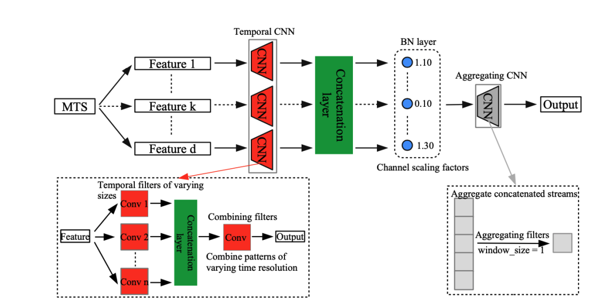

<h1 align="center">
  Implementation of Neural Feature Selector
</h1>

## Description

This is an implementation of the paper [Feature Selection for Multivariate Time Series via
Network Pruning](https://arxiv.org/pdf/2102.06024.pdf), that proposes a novel neural component, namely
**Neural Feature Selector (NFS)**, as an end-2-end solution for
feature selection in MTS data.

You can find the **building blocks** of the NFS in [neural_feature_selector.py](neural_feature_selector.py). In addition,
you can also check an easy demo in this [notebook](Neural_Network_Pruning_Feature_Selection.ipynb)!! 😏😏😏
